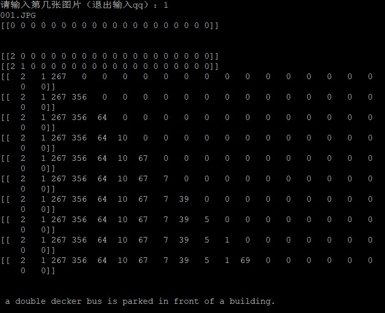

# Image Caption with VGG16/InceptionV3 + GRU
 

## Abstract 

This project is implementated by TensorFlow 1.14.x and keras, Finished in 2019.You can use both systems which contain two stages:CNN + RNN. During the image feature extract stage, there's one CNN Backbone and drop the last fully connected  Layer so that we could combined with RNN network that follows. And during the "caption" phase, we transform the words and string into a series of tokens(something like vectors), it helps us build one end-to-end training system.

## Highlights

- **Simple:** Just use two frameworks, but builds one end-to-end systeam, you can see the whole pipeline as one "big" Network.

- **Versatile:** Easy to change the Backbone and RNN module.

- **Easy to use:** We provide a interface call generate_caption_x for queries.

## Main results

### Image Caption on COCO validation

## Use the Caption Systeam

First, download the [COCO datasets](https://cocodataset.org/#download) and install the pythoncoco api.

Befor use you must train the model yourself, run(remember to change the path that datasets placed):

~~~
python Inception_GRU_train.py or VGG16_GRU_train.py
~~~

For test, run     

~~~
python VGG16_Inception_GRU.py
~~~
